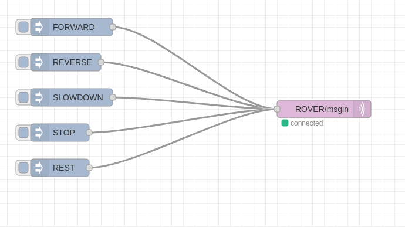

# Test plan

## Prerequisites 

1. Install Node-Red
2. Install Mosquitto
Note: For rover and station test any pc can be used for Node-Red and Mosquitto
Note: always use latest pull from Git

## Mosquitto

after installation run with configuration provided in github

## Node-red
after installation run node-red
import the flow given in the github 

## Rover Test

in Test_Rover tab

use inject buttons as given below to change states

use emergency button as given below to test emergency

## Station Test

in Test_Station tab

use buttons shown below to simulate messages from server

## Server Test
TBD
## HMI Test
TBD
